## agent执行流程
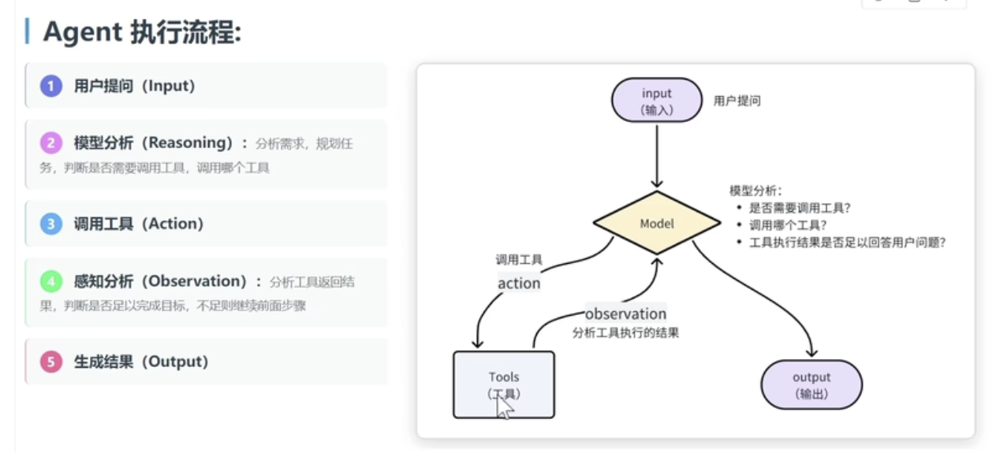

## agent时序图
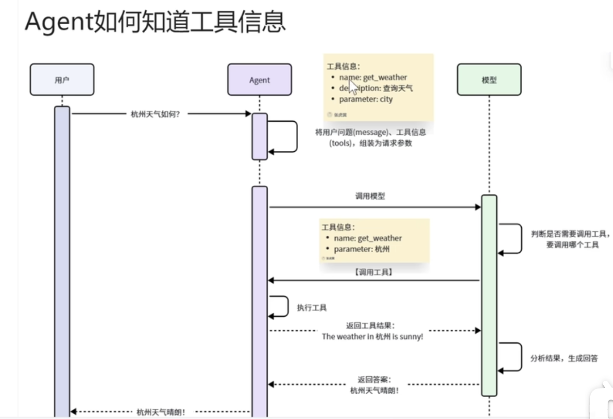

## 自定义模型
实例中的是千问百炼的模型，不是openai，所以要制定baseurl和apikey
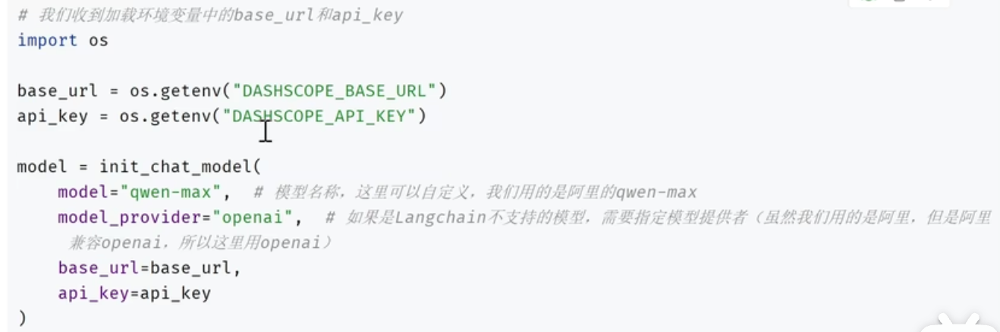

## 调试参数
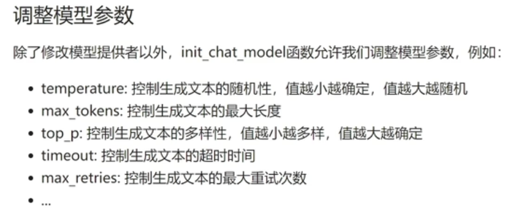

## 提示词工程
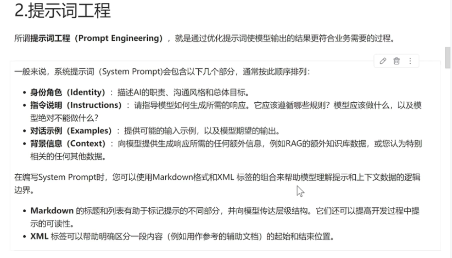

## 基于sqlite的checkpoint
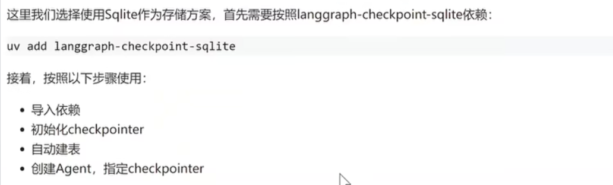

## 记忆管理策略
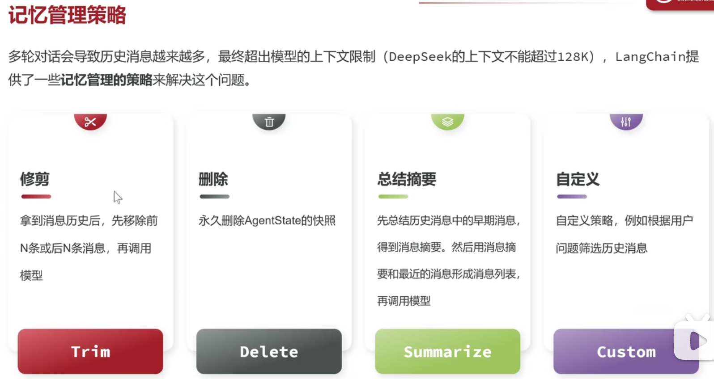

## 私厨管家需求分析
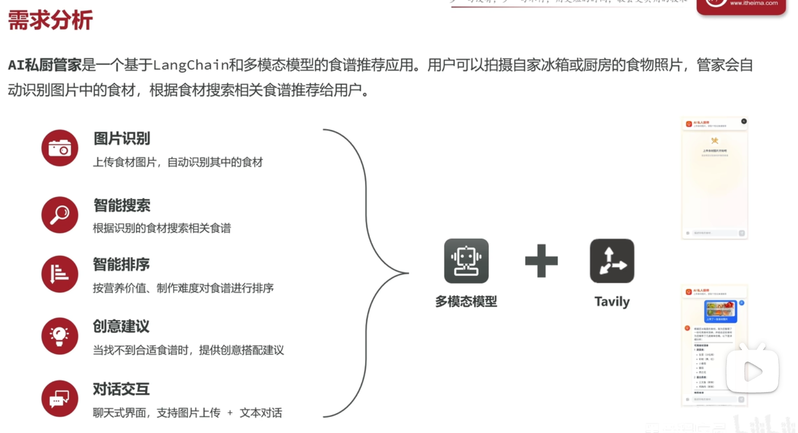

# 利用langsmith部署项目
注意点
1. 不要绑定checkpointer
2. 创建完agent既为代码部分结束

## 安装langgraph-cli
执行命令
> uv add langraph-cli[inmem]
如出现如下提示
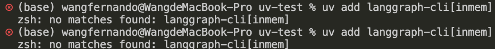
.zshrc中加 setopt no_nomatch，在执行source ~/.zshrc

## 配置langgraph.json
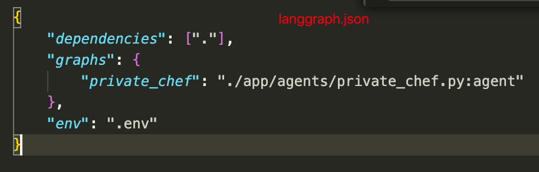

## 本地部署调试
> uv run langgraph dev

# 部署到生产
用langsmith部署到生产需要收费，一般都是通过自己搭建服务端
1. 集成checkpointer
2. 对上传的文件做oss存储
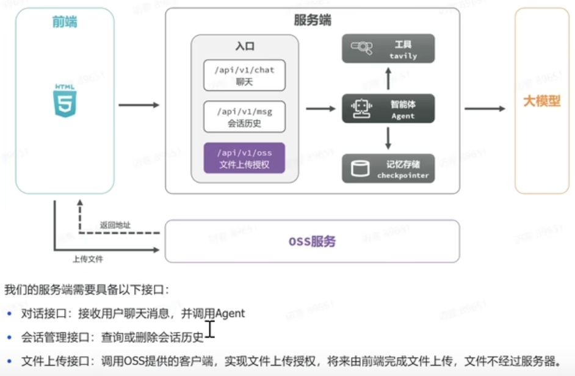
## 安装依赖(fastapi和oss)
> uv add fastapi alibabacloud-oss-v2
>

## 通用提示词模板
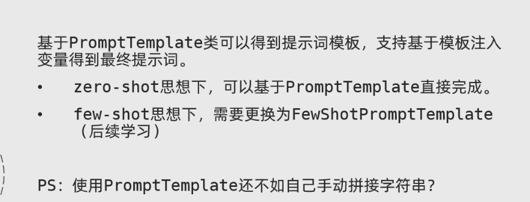

## fewShotPromptTemplate
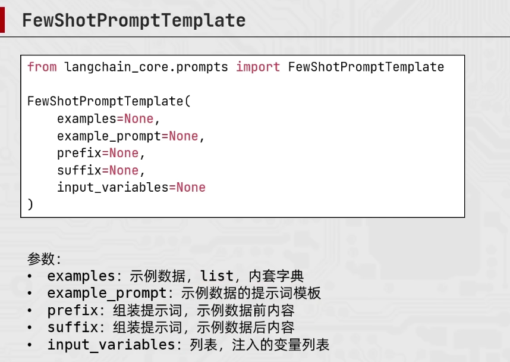